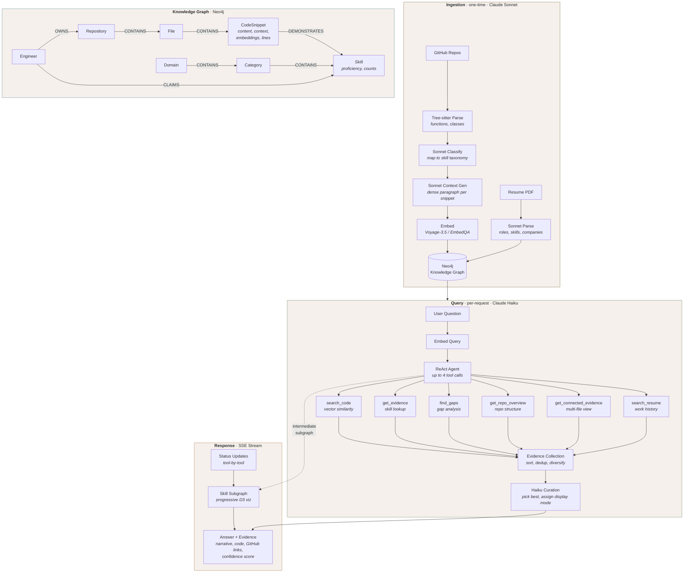

# ShowMeOff

AI-powered engineering portfolio agent. Ingests your resume and code repositories, builds a Neo4j knowledge graph of skills and evidence, and answers employer questions with cited, grounded code examples.

## What It Does

A recruiter asks *"Does this engineer know Kubernetes?"* — ShowMeOff searches 22K+ indexed code snippets, finds real implementations, and responds with proficiency assessment, curated evidence, and GitHub links. No hallucination — every claim is backed by code.

**Three modes:**
- **QA Chat** — ReAct agent with 6 tools, multi-turn conversation memory, and evidence curation
- **JD Match** — Paste a job description, get per-requirement match scores with code evidence
- **Competency Map** — Interactive graph visualization of the skill taxonomy

## Architecture



### Why Split Models

The system uses different models at different stages based on what each stage demands:

**Ingestion uses Claude Sonnet** — Context generation and skill classification happen once per code snippet and permanently affect embedding quality. Every snippet gets a dense paragraph describing its purpose, engineering patterns, and skill keywords. This is the highest-leverage LLM work in the system: a better context description means better vector search results for every future query. Sonnet's stronger reasoning produces richer, more precise descriptions that justify the ~5x cost premium over Haiku since it's a one-time cost amortized across all queries.

**Queries use Claude Haiku 4.5** — The ReAct loop, evidence curation, and answer generation run on every user question. A/B testing across 9 multi-turn queries showed Haiku matches Sonnet's quality for this task: it picks the right tools, includes more quantitative detail (specific counts, framework names), and follows format instructions well. The heavy lifting is already done by the embedding pipeline — Haiku just needs to orchestrate tools and synthesize results. At **4.8x cheaper** and **2.1x faster** than Sonnet, the tradeoff is clear.

**Embeddings use Voyage-3.5** (Anthropic pipeline) or **EmbedQA 1B** (NIM pipeline) — Anthropic doesn't offer an embedding model. Voyage-3.5 is the recommended pairing, with 1024-dim vectors and 8M TPM throughput.

### Provider Matrix

| Stage | NIM Pipeline (free) | Anthropic Pipeline | Why |
|---|---|---|---|
| Ingestion: classify + context | Sonnet → Nemotron fallback | Claude Sonnet (always) | Context quality is permanent, worth the cost |
| Ingestion: embed | EmbedQA 1B | Voyage-3.5 | One-time cost, stored per provider |
| Query: ReAct + curate | Nemotron 49B | Claude Haiku 4.5 | Runs every request, Haiku matches Sonnet quality here |
| Query: embed | EmbedQA 1B | Voyage-3.5 | Single embedding per query, fast |

The NIM pipeline is fully free (NVIDIA API key only). When `ANTHROPIC_API_KEY` is set, ingestion automatically upgrades to Sonnet regardless of `CHAT_PROVIDER` — this means even NIM-pipeline users get Sonnet-quality context generation for their embeddings.

### Conversation Memory

The QA agent supports multi-turn conversations. Each session stores condensed history (question + answer text, no evidence/tool internals) so follow-up questions like "tell me more about that" or "what concerns for this role?" resolve correctly. Sessions are server-side, keyed by ID, with LRU eviction at 200 sessions.

## Quick Start

```bash
# 1. Start Neo4j
docker compose up -d

# 2. Install dependencies
uv sync

# 3. Configure (.env)
cp .env.example .env
# Add at minimum: NVIDIA_API_KEY
# For quality pipeline: ANTHROPIC_API_KEY, VOYAGE_API_KEY

# 4. Ingest your data
uv run python -m src.ingestion.cli \
  --resume path/to/resume.pdf \
  --github-user your-username

# 5. Run
just dev
# → http://127.0.0.1:7860
```

### Anthropic Pipeline

```bash
CHAT_PROVIDER=anthropic EMBED_PROVIDER=voyage just dev
```

### Re-embed with Contextual Descriptions

Each code snippet gets a Sonnet-generated contextual description that bridges the vocabulary gap between natural language queries and raw code. Re-embedding processes all providers in parallel:

```bash
uv run python scripts/reembed.py                        # auto-detects all available providers
uv run python scripts/reembed.py --providers voyage nim  # explicit
```

## Environment Variables

| Variable | Default | Description |
|---|---|---|
| `CHAT_PROVIDER` | `nim` | `nim` or `anthropic` |
| `EMBED_PROVIDER` | `nim` | `nim` or `voyage` |
| `NVIDIA_API_KEY` | — | Required for NIM pipeline |
| `ANTHROPIC_API_KEY` | — | Required for `anthropic` chat; also enables Sonnet for ingestion |
| `VOYAGE_API_KEY` | — | Required for `voyage` embeddings |
| `CLAUDE_MODEL` | `claude-haiku-4-5-20251001` | Model for queries (ingestion always uses Sonnet) |
| `NEO4J_URI` | `bolt://localhost:7687` | |
| `NEO4J_PASSWORD` | `showmeoff` | |
| `GITHUB_TOKEN` | — | For private repo access during ingestion |
| `LOG_LEVEL` | `INFO` | `DEBUG`, `INFO`, `WARNING`, `ERROR` |

## Knowledge Graph

```
Engineer -[:OWNS]-> Repository -[:CONTAINS]-> File -[:CONTAINS]-> CodeSnippet -[:DEMONSTRATES]-> Skill
Domain -[:CONTAINS]-> Category -[:CONTAINS]-> Skill
Engineer -[:CLAIMS]-> Skill  (from resume)
Engineer -[:HELD]-> Role -[:AT]-> Company
```

Proficiency is computed from evidence density: **extensive** (10+ snippets across 2+ repos), **moderate** (3+), **minimal** (1+).

## Structured Logging

Every LLM call, embedding, tool execution, and curation decision is logged with session context, token counts, latency, and cost estimates.

- **Console**: colored human-readable output
- **File**: JSON lines at `logs/app.jsonl` for analysis

```bash
LOG_LEVEL=DEBUG just dev  # verbose mode
```

Sample session summary:
```json
{
  "session_id": "6c418440fbb1",
  "llm_calls": 3,
  "embed_calls": 1,
  "tool_calls": 2,
  "total_input_tokens": 11634,
  "total_output_tokens": 1948,
  "total_cost_usd": 0.011,
  "total_latency_ms": 8600
}
```

## Testing

```bash
uv run pytest tests/ -v              # all 43 tests
uv run pytest tests/test_qa.py -v    # just QA agent tests
```

## Project Structure

```
src/
├── app.py                      # FastAPI entry point, SSE streaming, session store
├── config/settings.py          # Env-based configuration
├── core/
│   ├── client_factory.py       # Provider-aware client construction (Sonnet for ingestion, Haiku for queries)
│   ├── claude_chat_client.py   # Anthropic adapter (OpenAI-compatible interface)
│   ├── nim_client.py           # NVIDIA NIM wrapper
│   ├── voyage_client.py        # Voyage embedding wrapper
│   ├── neo4j_client.py         # Graph DB client with vector search
│   └── logger.py               # Structured JSON logger with session auditing
├── ingestion/
│   ├── cli.py                  # Ingestion entry point
│   ├── graph_builder.py        # Code → Neo4j graph pipeline
│   ├── code_parser.py          # Tree-sitter chunking
│   ├── context_generator.py    # Sonnet contextual descriptions for embeddings
│   ├── skill_classifier.py     # Sonnet skill detection
│   └── skill_taxonomy.py       # 11 domains, 50+ skills hierarchy
├── qa/
│   ├── agent.py                # ReAct agent with conversation history and evidence curation
│   └── tools.py                # 6 tools (search, evidence, gaps, etc.)
└── jd_match/
    ├── agent.py                # Job description match agent
    ├── parser.py               # Requirement extraction
    └── matcher.py              # Vector-based requirement matching
```

## License

MIT
