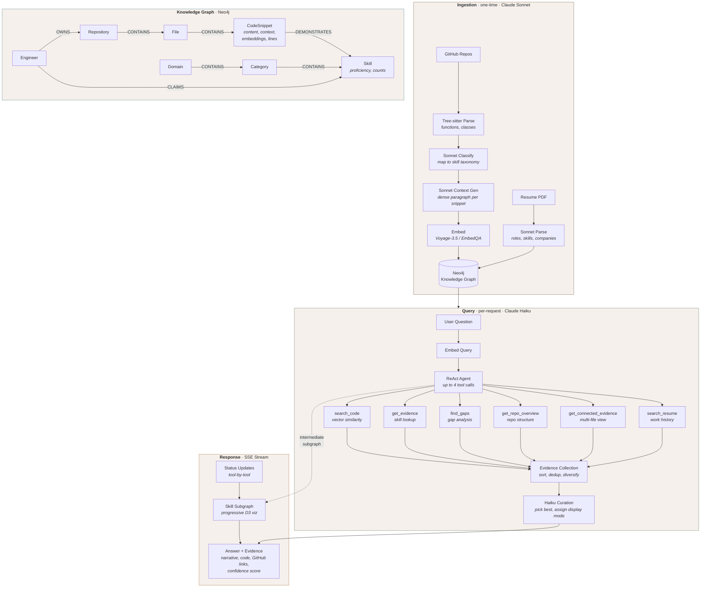
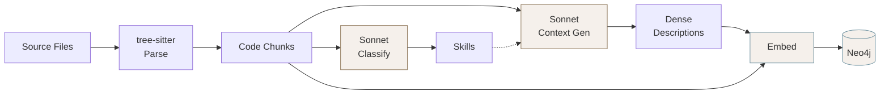
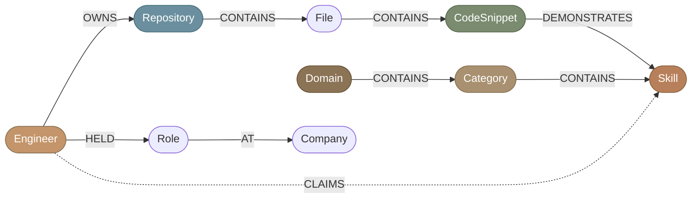
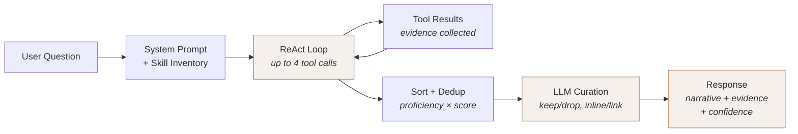
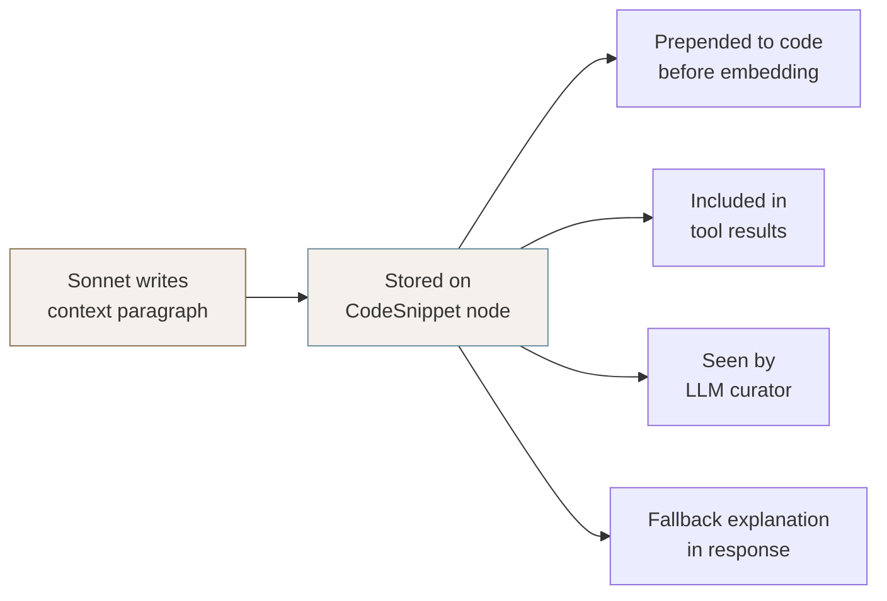

# PROVE

### Portfolio Reasoning Over Verified Evidence

[](https://python.org)
[](https://neo4j.com)
[](https://docker.com)
[]()
[-8b7355)](LICENSE)

> *"In God we trust; all others must bring data."* — W. Edwards Deming

PROVE turns your resume and GitHub repositories into a **queryable knowledge graph** where every skill claim is backed by real code. An AI agent answers questions about your engineering abilities with cited evidence, GitHub links, and proficiency scores — not vibes.

**The problem:** Portfolios are claims. "5 years of Python" tells a hiring manager nothing about *what* you built or *how* well you built it.

**The solution:** Ingest your code and resume into Neo4j, let Claude classify skills, generate searchable context, and embed everything. Then let anyone ask questions and get answers grounded in your actual work.

**Three modes:**
- **QA Chat** — ReAct agent with 6 tools, multi-turn memory, and evidence curation
- **JD Match** — Paste a job description, get per-requirement match scores with code evidence
- **Competency Map** — Interactive D3 treemap/bar visualization of the skill taxonomy

**Live demo:** [prove.codeblackwell.ai](https://prove.codeblackwell.ai)

---

## Table of Contents

- [Quick Start](#-quick-start)
- [How It Works](#-how-it-works)
  - [Ingestion Pipeline](#-ingestion-pipeline)
  - [Knowledge Graph](#%EF%B8%8F-knowledge-graph)
  - [Query Pipeline](#-query-pipeline)
  - [JD Match](#-jd-match)
- [Architecture](#%EF%B8%8F-architecture)
  - [Model Strategy](#model-strategy)
  - [Context Augmentation](#context-augmentation--the-technical-differentiator)
  - [Taxonomy-Aware Generation](#taxonomy-aware-generation)
  - [Dual Provider System](#dual-provider-system)
- [Configuration](#%EF%B8%8F-configuration)
- [Ingestion Guide](#-ingestion-guide)
- [Project Structure](#-project-structure)
- [Testing](#-testing)
- [Structured Logging](#-structured-logging)
- [Deployment](#-deployment)
- [Contributing](#-contributing)
- [License](#-license)

---

## Quick Start

Everything you need to go from a bare machine to a running instance.

### Prerequisites

| Tool | Why | Install |
|------|-----|---------|
| **Docker** | Runs Neo4j | [get.docker.com](https://get.docker.com) |
| **Python 3.11+** | Runtime | [python.org](https://python.org) |
| **uv** | Fast package manager | `curl -LsSf https://astral.sh/uv/install.sh \| sh` |
| **Git** | Clones repos during ingestion | Pre-installed on most systems |

### 1. Clone and install

```bash
git clone https://github.com/CodeBlackwell/Agent-Rep.git
cd Agent-Rep
uv sync
```

### 2. Start Neo4j

```bash
docker compose up -d
```

Wait a few seconds for Neo4j to become healthy. You can check at `http://localhost:7474`.

### 3. Configure your API keys

```bash
cp .env.example .env
```

Open `.env` and add your keys. You have two pipeline options:

> **Free pipeline:** Set `NVIDIA_API_KEY` only. Uses NVIDIA NIM for everything (Nemotron 49B + EmbedQA 1B). Good for trying it out.
>
> **Quality pipeline:** Set `ANTHROPIC_API_KEY` + `VOYAGE_API_KEY`. Ingestion auto-upgrades to Claude Sonnet for richer context descriptions. Queries use Haiku 4.5 (fast and cheap). This is what the live demo runs.

### 4. Ingest your data

Pick one:

```bash
# All public repos for a GitHub user
uv run python -m src.ingestion.cli \
  --resume path/to/resume.pdf \
  --github-user your-username

# Specific repos
uv run python -m src.ingestion.cli \
  --resume path/to/resume.pdf \
  --repos https://github.com/you/repo1 https://github.com/you/repo2
```

### 5. Run

```bash
just dev
# → http://127.0.0.1:7860
```

If you don't have `just`, the raw command is:

```bash
CHAT_PROVIDER=anthropic EMBED_PROVIDER=voyage uv run uvicorn src.app:app --port 7860 --reload
```

### 6. Verify

Open the browser and ask: *"What are this engineer's strongest skills?"* — you should see a narrative answer with GitHub-linked code evidence and a competency treemap building in the right panel.

---

## How It Works

> *"The purpose of a system is what it does."* — Stafford Beer



---

### Ingestion Pipeline

The ingestion pipeline transforms raw code and a resume into a searchable knowledge graph. It runs once (and is safe to re-run — it skips already-processed files).



**1. Parse** — Tree-sitter extracts every function and class from your source files. Supports Python, JavaScript, TypeScript, and TSX natively. Other languages get a fallback double-newline split so nothing is left behind.

**2. Classify** — Claude Sonnet reads each code snippet and maps it to skills from a curated taxonomy of ~85 skills across 11 domains (`src/ingestion/skill_taxonomy.py`). Snippets are batched (20 per LLM call) and processed concurrently. The classifier is constrained to the known skills list — no hallucinated skill names.

**3. Generate Context** — This is where the magic happens. Raw code like `def refresh_token(client, token):` never mentions "OAuth" or "security" — but a recruiter will search for exactly those terms. Sonnet writes a dense paragraph per snippet that bridges this vocabulary gap. Each description captures four things:

- **What it does** — the business/system purpose
- **Engineering patterns** — design patterns and techniques used
- **Skill keywords** — restated in standard industry vocabulary matching the taxonomy
- **Quality signals** — production traits like error handling, concurrency safety, type safety

These descriptions are stored permanently on each `CodeSnippet` node and improve every future query's vector search. See `src/ingestion/context_generator.py` for the full system prompt.

**4. Embed** — The final embedding input is `(context paragraph + metadata preamble + raw code)`, producing a 1024-dimensional vector. Vectors are stored per provider (`embedding_voyage` and `embedding_nim`) as separate Neo4j properties with separate vector indices.

**5. Link** — Cypher creates the graph edges. Git blame extracts the earliest and latest commit dates for each snippet, stored as `first_seen` / `last_seen` on the `:DEMONSTRATES` relationship.

---

### Knowledge Graph

The Neo4j knowledge graph connects engineers to their code through a typed skill taxonomy.



**Key node types:**

| Node | Key Properties | Notes |
|------|---------------|-------|
| `CodeSnippet` | `content`, `context`, `embedding_voyage`, `embedding_nim`, `start_line`, `end_line`, `language` | The atomic unit of evidence |
| `Skill` | `name`, `proficiency`, `snippet_count`, `repo_count` | Proficiency computed from evidence density |
| `Repository` | `name`, `default_branch`, `private` | Private flag controls code visibility |

**Proficiency levels** are computed from evidence density:

| Level | Threshold | Meaning |
|-------|-----------|---------|
| **Extensive** | 10+ snippets across 2+ repos | Deep, cross-project expertise |
| **Moderate** | 3+ snippets | Solid working knowledge |
| **Minimal** | 1+ snippet | Has touched it |

**The taxonomy** organizes skills into a 3-tier hierarchy: **Domain** (e.g., "Backend Engineering") > **Category** (e.g., "Web Frameworks") > **Skill** (e.g., "FastAPI"). 11 domains, 40+ categories, ~85 skills. See [`src/ingestion/skill_taxonomy.py`](src/ingestion/skill_taxonomy.py) for the full tree.

Resume-parsed skills create `:CLAIMS` edges — these are "unverified" until matched to code evidence via `:DEMONSTRATES`. The gap analysis tool uses this distinction to report which claims are backed by code and which are not.

---

### Query Pipeline

When someone asks *"Does this engineer know Kubernetes?"*, here's what happens:



**1. System prompt assembly** — The agent gets a dynamically built prompt containing a skill inventory sorted strongest-first with proficiency levels and evidence counts. This lets the model make intelligent tool selection without needing to search first.

**2. ReAct loop** — The agent makes up to 4 tool calls, choosing from 6 tools:

| Tool | What It Does | Best For |
|------|-------------|----------|
| `search_code` | Vector similarity across all snippets | Broad or specific skill questions |
| `get_evidence` | Direct skill node lookup with proficiency | Skill deep-dives |
| `search_resume` | Full-text search over resume data | Career and role questions |
| `find_gaps` | Hierarchy-aware gap analysis | "What's missing for this role?" |
| `get_repo_overview` | Repo structure, file counts, top skills | Architecture questions |
| `get_connected_evidence` | Multi-file snippets within one repo | System design questions |

**3. Evidence sorting** — Results are ranked by proficiency weight + similarity score, deduplicated by file path (keeping the best snippet per file), and interleaved by repository for diversity.

**4. LLM curation** — The model reviews the top evidence and makes per-snippet decisions: keep or drop, display inline (show the code) or as a link (show an architectural explanation instead). Trivial code (one-line configs, bare imports) gets dropped. Each kept snippet gets a 1-2 sentence explanation of *why it's impressive*.

**5. Response** — A 2-3 sentence narrative naming specific repos, followed by curated evidence blocks with GitHub links (including line numbers), explanations, and optional inline code. A confidence score (Strong/Partial/None) with total evidence count closes it out.

Private repository code is automatically redacted from responses when `SHOW_PRIVATE_CODE=false` — context descriptions and GitHub links are still shown, but raw code is not.

---

### JD Match

Upload a job description (PDF, DOCX, or paste text) and PROVE breaks it into individual technical requirements, embeds each one, runs vector search against the knowledge graph, and computes per-requirement confidence:

- **Strong** — 3+ high-scoring code examples with extensive/moderate proficiency
- **Partial** — Some evidence, lower scores or fewer examples
- **None** — No matching code found

Each requirement expands to show the matching code evidence with GitHub links. An overall match percentage and LLM-generated summary tie it together.

---

## Architecture

> *"Simplicity is prerequisite for reliability."* — Edsger W. Dijkstra

### Model Strategy

The system deliberately uses different models at different stages — not because of cost alone, but because each stage has different quality/speed requirements.

**Ingestion uses Claude Sonnet (always).** Context generation and skill classification happen once per code snippet and permanently affect embedding quality. A better context description means better vector search results for *every future query*. This is the highest-leverage LLM work in the system — Sonnet's stronger reasoning produces richer, more precise descriptions that justify the cost premium since it's a one-time investment amortized across all queries.

**Queries use Claude Haiku 4.5.** The ReAct loop, evidence curation, and answer generation run on every user question. A/B testing across 9 multi-turn conversations showed Haiku matches Sonnet's quality for this task — it picks the right tools, includes quantitative detail, and follows format instructions well. The heavy lifting is already done by the embedding pipeline. At **4.8x cheaper** and **2.1x faster** than Sonnet, the tradeoff is clear.

**Provider matrix:**

| Stage | NIM Pipeline (free) | Anthropic Pipeline | Why |
|---|---|---|---|
| Ingestion: classify + context | Sonnet (if key set) or Nemotron | Claude Sonnet (always) | Context quality is permanent |
| Ingestion: embed | EmbedQA 1B | Voyage-3.5 | One-time cost, stored per provider |
| Query: ReAct + curate | Nemotron 49B | Claude Haiku 4.5 | Runs every request — speed matters |
| Query: embed | EmbedQA 1B | Voyage-3.5 | Single embedding per query |

When `ANTHROPIC_API_KEY` is set, ingestion automatically upgrades to Sonnet *regardless of `CHAT_PROVIDER`*. Even NIM-pipeline users get Sonnet-quality context generation.

### Context Augmentation — The Technical Differentiator

Consider this function signature: `def refresh_token(client, token):`. A recruiter searching for "OAuth experience" will never find it via naive code search — the word "OAuth" appears nowhere in the code. This vocabulary gap between how humans describe skills and how code implements them is the core retrieval challenge.

PROVE solves this at ingestion time. For every code snippet, Sonnet generates a dense contextual paragraph that restates what the code proves in human-searchable vocabulary:

> *"Implements OAuth2 refresh token rotation using the client credentials grant. Demonstrates secure token lifecycle management with automatic retry on network failure. Shows production-quality patterns: exponential backoff, thread-safe token caching, and structured error propagation."*

This `context` field is stored on the `CodeSnippet` node and flows through the entire system:



- **Embedding** — prepended to code before vectorization, so the vector captures both semantics and implementation
- **Tool results** — included in ReAct loop responses so the model can reason about code purpose
- **Curation** — the curator sees it when deciding inline vs. link display mode
- **Display** — used as the explanation fallback when the curator doesn't provide one

**No embedding without context:** The `reembed.py` script enforces this — Phase 1 generates missing context descriptions, Phase 2 only embeds snippets that have them.

### Taxonomy-Aware Generation

The ~85-skill taxonomy isn't just for classification — it shapes the entire pipeline:

- **Classifier** receives the full skills list, constraining output to known skills (no hallucinated or misspelled skill names)
- **Context generator** receives it too, ensuring descriptions use standardized vocabulary that aligns with how skills are stored and searched
- **Gap analysis** is hierarchy-aware: if "Kubernetes" isn't demonstrated, the `find_gaps` tool checks the "Containers & Orchestration" category for related skills like "Docker" before reporting a hard gap

The taxonomy covers 11 domains from AI/ML through Security to Domain-Specific specializations. See the full tree in [`src/ingestion/skill_taxonomy.py`](src/ingestion/skill_taxonomy.py).

### Dual Provider System

Two environment variables control everything: `CHAT_PROVIDER` (`nim` or `anthropic`) and `EMBED_PROVIDER` (`nim` or `voyage`). The `build_clients()` factory in `src/core/client_factory.py` returns all clients as a dict. All chat clients share the same `.chat(messages, tools, purpose)` interface — `ClaudeChatClient` adapts Anthropic's format internally.

Embeddings are **provider-namespaced** in Neo4j: `embedding_nim` and `embedding_voyage` are separate properties with separate vector indices. Switching embedding providers requires running `reembed.py` to populate the new vectors.

### Conversation Memory

The QA agent supports multi-turn conversations. Each session stores condensed history in SQLite — question + answer text only, no evidence or tool internals — so follow-up questions like *"tell me more about that"* or *"what about React?"* resolve correctly. History is injected between the system prompt and new question. Max 20 turns per session.

### SSE Streaming and Visualization

Responses stream via Server-Sent Events with four event types:

| Event | Payload | Purpose |
|-------|---------|---------|
| `session` | Session ID | Conversation tracking |
| `status` | Phase, tool name, args | Live tool-call progress tracker |
| `graph` | Nodes + edges | Progressive D3 visualization |
| *(default)* | Answer text | Streamed narrative + evidence |

The frontend renders a glassmorphic UI with two visualization modes — **Treemap** (nested rectangles: Domain > Category > Skill, tile size = evidence count) and **Bars** (ranked skill list). The graph accumulates across queries within a session. Clicking any demonstrated skill opens a reference modal with all code evidence and GitHub links.

Rate limiting protects API costs: 20 chat requests/hour and 60 reads/hour per visitor, identified by IP + lightweight browser fingerprint.

---

## Configuration

```bash
cp .env.example .env
```

### Required (pick at least one pipeline)

| Variable | Notes |
|----------|-------|
| `NVIDIA_API_KEY` | Required for NIM pipeline (free) |
| `ANTHROPIC_API_KEY` | Required for Anthropic chat; also enables Sonnet for ingestion |
| `VOYAGE_API_KEY` | Required for Voyage embeddings |

### Pipeline Selection

| Variable | Default | Options |
|----------|---------|---------|
| `CHAT_PROVIDER` | `nim` | `nim` or `anthropic` |
| `EMBED_PROVIDER` | `nim` | `nim` or `voyage` |
| `CLAUDE_MODEL` | `claude-haiku-4-5-20251001` | Query model only — ingestion always uses Sonnet |

### Database and Graph

| Variable | Default | Notes |
|----------|---------|-------|
| `NEO4J_URI` | `bolt://localhost:7687` | Auto-set in `docker-compose.prod.yml` |
| `NEO4J_USER` | `neo4j` | |
| `NEO4J_PASSWORD` | `showmeoff` | Change this in production |
| `DB_PATH` | `data/showmeoff.db` | SQLite for conversations, logs, rate limits |

### GitHub

| Variable | Default | Notes |
|----------|---------|-------|
| `GITHUB_TOKEN` | — | Enables private repo access during ingestion |
| `GITHUB_OWNER` | `codeblackwell` | Username for GitHub links in responses |
| `SHOW_PRIVATE_CODE` | `false` | When `false`, private repo code is redacted (context + links still shown) |

### Deployment and Logging

| Variable | Default | Notes |
|----------|---------|-------|
| `DOMAIN` | `localhost` | Your domain for Caddy auto-HTTPS (production only) |
| `LOG_LEVEL` | `INFO` | `DEBUG`, `INFO`, `WARNING`, `ERROR` |

---

## Ingestion Guide

For more control than the Quick Start provides.

### Resume Formats

PDF (via pypdf), DOCX (via python-docx), Markdown, and plain text. Sonnet extracts name, roles, companies, and skills. If an Engineer node already exists in the graph, re-ingestion reuses it.

### Repo Sources

```bash
# Explicit repos (GitHub URLs or local paths)
--repos https://github.com/user/repo1 /path/to/local/repo

# All repos for a GitHub user (paginates automatically, skips forks)
--github-user username
```

For private repos, set `GITHUB_TOKEN` in `.env`. Private repos are ingested identically to public ones — the `private` flag on the `Repository` node controls whether raw code appears in query responses (governed by `SHOW_PRIVATE_CODE`).

### Supported Languages

| Language | Parser | Extracts |
|----------|--------|----------|
| Python | tree-sitter-python | Functions, classes |
| JavaScript | tree-sitter-javascript | Functions, classes |
| TypeScript | tree-sitter-typescript | Functions, classes |
| TSX | tree-sitter-tsx | Functions, classes |
| Other (`.java`, `.go`, `.rs`, `.rb`, `.cpp`, `.c`, `.h`) | Fallback | Double-newline blocks |

### Re-embedding

If you change embedding providers, add repos, or want to regenerate context descriptions:

```bash
uv run python scripts/reembed.py                        # auto-detects providers from .env
uv run python scripts/reembed.py --providers voyage      # just Voyage
uv run python scripts/reembed.py --providers nim voyage   # explicit both
```

This runs in two phases:
1. **Phase 1** — Generate missing Sonnet context descriptions (the `context` field on `CodeSnippet` nodes)
2. **Phase 2** — Embed all snippets that have context, in parallel across providers

The pipeline is idempotent — it skips snippets that already have embeddings for the target provider. Safe to re-run anytime.

---

## Project Structure

```
src/
├── app.py                        # FastAPI entry point, SSE streaming, rate limiting
├── config/settings.py            # Env-based configuration dataclass
├── core/
│   ├── client_factory.py         # Provider-aware client construction
│   ├── claude_chat_client.py     # Anthropic adapter (OpenAI-compatible interface)
│   ├── nim_client.py             # NVIDIA NIM wrapper (chat + embeddings)
│   ├── voyage_client.py          # Voyage embedding wrapper
│   ├── neo4j_client.py           # Graph DB client with vector search
│   ├── db.py                     # SQLite persistence (conversations, logs, rate limits)
│   └── logger.py                 # Structured JSON logger with session auditing
├── ingestion/
│   ├── cli.py                    # Ingestion entry point (resume + repos)
│   ├── graph_builder.py          # Code → Neo4j graph pipeline
│   ├── code_parser.py            # Tree-sitter chunking (Python, JS, TS, TSX)
│   ├── context_generator.py      # Sonnet contextual descriptions for embeddings
│   ├── skill_classifier.py       # Sonnet skill detection against taxonomy
│   ├── skill_taxonomy.py         # 11 domains, 40+ categories, ~85 skills
│   └── resume_parser.py          # Resume extraction (PDF, DOCX, MD, TXT)
├── qa/
│   ├── agent.py                  # ReAct agent with curation and conversation history
│   └── tools.py                  # 6 tools (search, evidence, gaps, repos, resume)
├── jd_match/
│   ├── agent.py                  # Job description match orchestrator
│   ├── parser.py                 # Requirement extraction via LLM
│   └── matcher.py                # Vector-based per-requirement matching
├── ui/
│   └── competency_map.py         # Graph visualization data (treemap, bars, tooltips)
├── static/
│   ├── chat.js                   # Chat SSE streaming + message rendering
│   ├── graph.js                  # D3 treemap/bars + reference modals
│   ├── jd.js                     # JD match modal + results UI
│   ├── fingerprint.js            # Lightweight browser fingerprinting for rate limits
│   └── style.css                 # Glassmorphic design system
├── templates/
│   └── index.html                # Single-page app shell
scripts/
├── reembed.py                    # Context generation + embedding pipeline
└── deploy.sh                     # Fresh VPS deployment script
```

---

## Testing

```bash
uv run pytest tests/ -v              # all 56 tests (~0.35s)
uv run pytest tests/test_qa.py -v    # QA agent (ReAct loop, curation, formatting, streaming)
uv run pytest tests/test_ingestion.py -v  # Parsing, graph building, skill extraction
uv run pytest tests/test_jd_match.py -v   # Requirement parsing, matching, confidence
uv run pytest tests/test_db.py -v         # SQLite persistence, rate limiting
```

Tests mock all LLM calls and run against a real Neo4j instance (requires `docker compose up -d`).

---

## Structured Logging

Every LLM call, embedding, tool execution, and curation decision is logged with session context, token counts, latency, and cost estimates.

- **Console** — Colored human-readable output
- **File** — JSON lines at `logs/app.jsonl`
- **SQLite** — Queryable via `/api/logs` endpoint

```bash
LOG_LEVEL=DEBUG just dev  # verbose mode
```

**Cost estimation** per model:

| Model | Input ($/M tokens) | Output ($/M tokens) |
|-------|-------------------:|--------------------:|
| Claude Sonnet | $3.00 | $15.00 |
| Claude Haiku 4.5 | $1.00 | $5.00 |
| Voyage-3.5 | $0.06 | — |
| NIM (Nemotron + EmbedQA) | Free | Free |

Sample session summary:
```json
{
  "session_id": "6c418440fbb1",
  "llm_calls": 3,
  "embed_calls": 1,
  "tool_calls": 2,
  "total_input_tokens": 11634,
  "total_output_tokens": 1948,
  "total_cost_usd": 0.011,
  "total_latency_ms": 8600
}
```

---

## Deployment

> *"Real artists ship."* — Steve Jobs

### Production Stack

`docker-compose.prod.yml` runs three services:

| Service | Role | Exposed? |
|---------|------|----------|
| **app** | FastAPI on :7860 | Internal only |
| **neo4j** | Neo4j 5 Community with healthcheck | Internal only |
| **caddy** | Reverse proxy, auto-HTTPS via Let's Encrypt | :80, :443 |

Neo4j is never exposed to the internet. Caddy handles TLS automatically.

### Deploy Commands

```bash
# Fresh VPS setup (Ubuntu 22.04+)
ssh root@your-server 'bash -s' < scripts/deploy.sh

# On the server: configure and start
cd /opt/showmeoff
nano .env  # Set DOMAIN, API keys, NEO4J_PASSWORD
docker compose -f docker-compose.prod.yml up -d --build

# View logs
docker compose -f docker-compose.prod.yml logs -f

# Update after code changes
cd /opt/showmeoff && git pull && docker compose -f docker-compose.prod.yml up -d --build
```

### Security

- Caddy adds security headers (`X-Content-Type-Options`, `X-Frame-Options`, `Referrer-Policy`)
- Rate limits: 20 chat requests/hour, 60 reads/hour per visitor (IP + browser fingerprint)
- Localhost is exempt from rate limits for development
- Private repo code filtered at the backend (`SHOW_PRIVATE_CODE` setting)
- Secrets live in `.env` on the server (never committed)

---

## Contributing

PRs welcome. Please run the tests before submitting:

```bash
docker compose up -d  # Neo4j must be running
uv run pytest tests/ -v
```

---

## License

PROVE is open source under a [modified MIT license](LICENSE). Use it, fork it, make it yours.

All I ask: keep the attribution, and if it helped you — let's chat. I'm building cool things and always down to connect.

[GitHub](https://github.com/codeblackwell) | [LinkedIn](https://linkedin.com/in/codeblackwell)

---

*Made with intent by [@CodeBlackwell](https://github.com/codeblackwell)*
