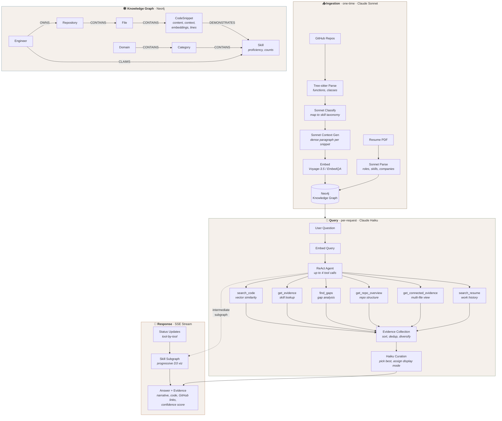

# 🧠 PROVE

### Portfolio Reasoning Over Verified Evidence

[](https://python.org)
[](https://neo4j.com)
[](https://docker.com)
[](https://github.com/CodeBlackwell/PROVE/actions/workflows/ci.yml)
[](https://github.com/astral-sh/ruff)
[-8b7355)](LICENSE)

> *"In God we trust; all others must bring data."* — W. Edwards Deming

PROVE turns your actual code into proof of what you know. Point it at a resume and
some GitHub repos; it builds a Neo4j knowledge graph of code-backed skill evidence,
then answers questions about your experience with real snippets, GitHub links, and
computed proficiency scores.

**🔗 Live demo:** [prove.codeblackwell.ai](https://prove.codeblackwell.ai)

---

## ✨ What Makes PROVE Special

🔬 **Evidence, Not Vibes** — Every skill claim is backed by real code snippets, GitHub links, and computed proficiency scores. No self-reported ratings.

🧩 **Semantic Bridge** — Claude Sonnet writes dense context paragraphs for every code snippet at ingestion time, solving the vocabulary gap between how recruiters search ("OAuth experience") and how code reads (`def refresh_token`). This is the secret sauce — it makes every future search smarter.

🤖 **ReAct Agent with Receipts** — The query agent reasons, it doesn't just search: up to 4 tool calls per question across vector search, skill graphs, resume data, and architecture summaries, then an LLM curator picks only the most impressive snippets.

📊 **Living Knowledge Graph** — A Neo4j graph where `Engineer → Repository → File → CodeSnippet → Skill` relationships answer questions like *"What skills are claimed but unverified?"*

⚡ **Smart Model Routing** — Sonnet for the expensive one-time ingestion work, Haiku for fast per-request queries (A/B tested: matches Sonnet quality at 4.8x cheaper).

🎯 **Three Modes, One Graph** — QA chat with multi-turn memory, JD matching with per-requirement confidence, and an interactive D3 competency treemap.

### Who it's for

- **Engineers** — Replace "5 years of Python" with a live system that *proves* it; find your own gaps before an interviewer does.
- **Hiring managers** — Ask any question and get code-backed answers with confidence scores; paste a JD for per-requirement match scores. Pre-screen technical depth in seconds.
- **The economics** — ~$0.01/query on Haiku. Free tier via NVIDIA NIM; quality tier (Anthropic + Voyage) is ~$2–5 for a full codebase ingestion.

---

## 🏗️ Architecture at a Glance


```mermaid
flowchart TB
    subgraph INGEST["<b>📥 Ingestion</b> · one-time · Claude Sonnet"]
        direction TB
        R[Resume PDF] --> RP[Sonnet Parse<br><i>roles, skills, companies</i>]
        G[GitHub Repos] --> TS[Tree-sitter Parse<br><i>functions, classes</i>]
        TS --> SC[Sonnet Classify<br><i>map to skill taxonomy</i>]
        SC --> CG[Sonnet Context Gen<br><i>dense paragraph per snippet</i>]
        CG --> EM[Embed<br><i>Voyage-3.5 / EmbedQA</i>]
        EM --> N4[(Neo4j<br>Knowledge Graph)]
        RP --> N4
    end

    subgraph GRAPH["<b>🕸️ Knowledge Graph</b> · Neo4j"]
        direction LR
        ENG[Engineer] -->|OWNS| REPO[Repository]
        REPO -->|CONTAINS| FILE[File]
        FILE -->|CONTAINS| CS[CodeSnippet<br><i>content, context,<br>embeddings, lines</i>]
        CS -->|DEMONSTRATES| SK[Skill<br><i>proficiency, counts</i>]
        DOM[Domain] -->|CONTAINS| CAT[Category]
        CAT -->|CONTAINS| SK
        ENG -->|CLAIMS| SK
    end

    subgraph QUERY["<b>💬 Query</b> · per-request · Claude Haiku"]
        direction TB
        Q[User Question] --> EMQ[Embed Query]
        EMQ --> REACT[ReAct Agent<br><i>up to 4 tool calls</i>]
        REACT --> T1[search_code<br><i>vector similarity</i>]
        REACT --> T2[get_evidence<br><i>skill lookup</i>]
        REACT --> T3[find_gaps<br><i>gap analysis</i>]
        REACT --> T4[get_repo_overview<br><i>repo structure</i>]
        REACT --> T5[get_connected_evidence<br><i>multi-file view</i>]
        REACT --> T6[search_resume<br><i>work history</i>]
        T1 & T2 & T3 & T4 & T5 & T6 --> EV[Evidence Collection<br><i>sort, dedup, diversify</i>]
        EV --> CUR[Haiku Curation<br><i>pick best, assign display mode</i>]
    end

    subgraph STREAM["<b>📡 Response</b> · SSE Stream"]
        direction LR
        SS[Status Updates<br><i>tool-by-tool</i>] --> SG[Skill Subgraph<br><i>progressive D3 viz</i>]
        SG --> ANS[Answer + Evidence<br><i>narrative, code, GitHub links,<br>confidence score</i>]
    end

    N4 --> QUERY
    REACT -.->|intermediate<br>subgraph| SG
    CUR --> ANS

    style INGEST fill:#f5f0eb,stroke:#8b7355,color:#2c2c2c
    style GRAPH fill:#f5f0eb,stroke:#6b8f9e,color:#2c2c2c
    style QUERY fill:#f5f0eb,stroke:#7a8b6f,color:#2c2c2c
    style STREAM fill:#f5f0eb,stroke:#b8805a,color:#2c2c2c
```

→ **Full pipeline walkthrough:** [docs/HOW_IT_WORKS.md](docs/HOW_IT_WORKS.md) · **Design rationale:** [docs/ARCHITECTURE.md](docs/ARCHITECTURE.md)

---

## 🚀 Quick Start

### Prerequisites

| Tool | Why | Install |
|------|-----|---------|
| 🐳 **Docker** | Runs Neo4j | [get.docker.com](https://get.docker.com) |
| 🐍 **Python 3.11+** | Runtime | [python.org](https://python.org) |
| 📦 **uv** | Fast package manager | `curl -LsSf https://astral.sh/uv/install.sh \| sh` |
| 🔀 **Git** | Clones repos during ingestion | Pre-installed on most systems |

### 1. Clone and install

```bash
git clone https://github.com/CodeBlackwell/PROVE.git
cd PROVE
uv sync
```

### 2. Fire up Neo4j 🔥

```bash
docker compose up -d
```

Wait a few seconds for Neo4j to become healthy — check at `http://localhost:7474`.

### 3. Configure 🔑

```bash
cp .env.example .env
```

Add your API keys to `.env`. Two pipeline options:

> 🆓 **Free pipeline:** Set `NVIDIA_API_KEY` only. Uses NVIDIA NIM for everything (Nemotron 49B + EmbedQA 1B).
>
> 💎 **Quality pipeline:** Set `ANTHROPIC_API_KEY` + `VOYAGE_API_KEY`. Ingestion auto-upgrades to Claude Sonnet; queries use Haiku 4.5. This is what the live demo runs.

To run PROVE for someone other than the default subject, edit **`subject.toml`** (name, naming rules, GitHub owner, domain). See [docs/CONFIGURATION.md](docs/CONFIGURATION.md).

### 4. Ingest your data 🍽️

```bash
# All public repos for a GitHub user
uv run python -m src.ingestion.cli --resume path/to/resume.pdf --github-user your-username

# Or specific repos
uv run python -m src.ingestion.cli --resume path/to/resume.pdf \
  --repos https://github.com/you/repo1 https://github.com/you/repo2
```

More options (private repos, languages, re-embedding) in [docs/INGESTION.md](docs/INGESTION.md).

### 5. Launch! 🚀

```bash
just dev
# → http://127.0.0.1:7860
```

No `just`? The raw command:

```bash
CHAT_PROVIDER=anthropic EMBED_PROVIDER=voyage uv run uvicorn src.app:app --port 7860 --reload
```

### 6. Verify ✅

Ask: *"What are this engineer's strongest skills?"* — you should see a narrative answer with GitHub-linked code evidence and a competency treemap building in the right panel. 🏆

---

## 📚 Documentation

| Doc | What's inside |
|-----|---------------|
| [How It Works](docs/HOW_IT_WORKS.md) | Ingestion, knowledge graph, query pipeline, and JD match — with diagrams |
| [Architecture](docs/ARCHITECTURE.md) | Model strategy, context augmentation, taxonomy, dual-provider system, SSE streaming |
| [Configuration](docs/CONFIGURATION.md) | `subject.toml` + every environment variable |
| [Ingestion Guide](docs/INGESTION.md) | Resume formats, repo sources, languages, re-embedding, architecture summaries |
| [Development](docs/DEVELOPMENT.md) | Project structure, testing, structured logging |
| [Deployment](docs/DEPLOYMENT.md) | Production stack, deploy commands, security |
| [Contributing](CONTRIBUTING.md) | Local setup and the checks CI runs |

---

## 🤝 Contributing

PRs welcome 🛠️ See [CONTRIBUTING.md](CONTRIBUTING.md) for setup and conventions. Before submitting:

```bash
uv run ruff check src tests
uv run ruff format --check src tests
uv run pytest tests/ -m "not e2e"   # Neo4j must be running
```

---

## 📝 License

PROVE is open source under a [modified MIT license](LICENSE). Use it, fork it, make it yours 🎁

All I ask: keep the attribution, and if it helped you — let's chat.

[GitHub](https://github.com/codeblackwell) | [LinkedIn](https://linkedin.com/in/codeblackwell)

---

*Made with 🔥 and intent by [@CodeBlackwell](https://github.com/codeblackwell)*
