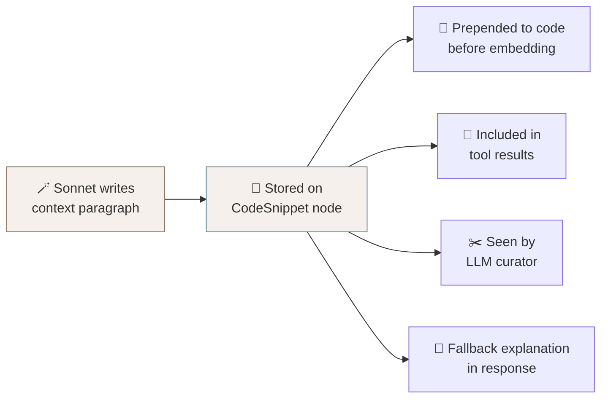

# 🏗️ Architecture

> *"Simplicity is prerequisite for reliability."* — Edsger W. Dijkstra

[← Back to README](../README.md) · See also [How It Works](HOW_IT_WORKS.md) · [Configuration](CONFIGURATION.md)

---

## 🧠 Model Strategy

The system deliberately uses different models at different stages — not because of cost alone, but because each stage has different quality/speed requirements. It's about spending wisely, not spending less 💡

**Ingestion uses Claude Sonnet (always).** Context generation and skill classification happen once per code snippet and permanently affect embedding quality. A better context description means better vector search results for *every future query*. This is the highest-leverage LLM work in the system — Sonnet's stronger reasoning produces richer, more precise descriptions that justify the cost premium since it's a one-time investment amortized across all queries.

**Queries use Claude Haiku 4.5.** The ReAct loop, evidence curation, and answer generation run on every user question. A/B testing across 9 multi-turn conversations showed Haiku matches Sonnet's quality for this task — it picks the right tools, includes quantitative detail, and follows format instructions well. The heavy lifting is already done by the embedding pipeline. At **4.8x cheaper** and **2.1x faster** than Sonnet, the tradeoff is clear.

**Provider matrix:**

| Stage | NIM Pipeline (free) 🆓 | Anthropic Pipeline 💎 | Why |
|---|---|---|---|
| Ingestion: classify + context | Sonnet (if key set) or Nemotron | Claude Sonnet (always) | Context quality is permanent |
| Ingestion: embed | EmbedQA 1B | Voyage-3.5 | One-time cost, stored per provider |
| Query: ReAct + curate | Nemotron 49B | Claude Haiku 4.5 | Runs every request — speed matters |
| Query: embed | EmbedQA 1B | Voyage-3.5 | Single embedding per query |

When `ANTHROPIC_API_KEY` is set, ingestion automatically upgrades to Sonnet *regardless of `CHAT_PROVIDER`*. Even NIM-pipeline users get Sonnet-quality context generation. Free upgrade — you're welcome 😎

## 🪄 Context Augmentation — The Secret Sauce

> Deep dive (technique, cost model, evidence, ablation recipe): [Context-Augmented Embeddings](CONTEXT_AUGMENTED_EMBEDDINGS.md).

Consider this function signature: `def refresh_token(client, token):`. A recruiter searching for "OAuth experience" will never find it via naive code search — the word "OAuth" appears nowhere in the code. This vocabulary gap between how humans describe skills and how code implements them is the core retrieval challenge.

PROVE solves this at ingestion time. For every code snippet, Sonnet generates a dense contextual paragraph that restates what the code proves in human-searchable vocabulary:

> *"Implements OAuth2 refresh token rotation using the client credentials grant. Demonstrates secure token lifecycle management with automatic retry on network failure. Shows production-quality patterns: exponential backoff, thread-safe token caching, and structured error propagation."*

This `context` field is stored on the `CodeSnippet` node and flows through the entire system:

- **Embedding** — prepended to code before vectorization, so the vector captures both semantics and implementation
- **Tool results** — included in ReAct loop responses so the model can reason about code purpose
- **Curation** — the curator sees it when deciding inline vs. link display mode
- **Display** — used as the explanation fallback when the curator doesn't provide one

**No embedding without context:** The `reembed.py` script enforces this — Phase 1 generates missing context descriptions, Phase 2 only embeds snippets that have them. No shortcuts 🚫

## 🏷️ Taxonomy-Aware Generation

The ~85-skill taxonomy isn't just for classification — it shapes the entire pipeline:

- 🎯 **Classifier** receives the full skills list, constraining output to known skills (no hallucinated or misspelled skill names)
- 📝 **Context generator** receives it too, ensuring descriptions use standardized vocabulary that aligns with how skills are stored and searched
- 🔍 **Gap analysis** is hierarchy-aware: if "Kubernetes" isn't demonstrated, the `find_gaps` tool checks the "Containers & Orchestration" category for related skills like "Docker" before reporting a hard gap

The taxonomy covers 11 domains from AI/ML through Security to Domain-Specific specializations. See the full tree in [`src/ingestion/skill_taxonomy.py`](../src/ingestion/skill_taxonomy.py).

## 🔀 Dual Provider System

Two environment variables control everything: `CHAT_PROVIDER` (`nim` or `anthropic`) and `EMBED_PROVIDER` (`nim` or `voyage`). The `build_clients()` factory in `src/core/client_factory.py` returns all clients as a dict. All chat clients share the same `.chat(messages, tools, purpose)` interface — `ClaudeChatClient` adapts Anthropic's format internally.

Embeddings are **provider-namespaced** in Neo4j: `embedding_nim` and `embedding_voyage` are separate properties with separate vector indices. Switching embedding providers requires running `reembed.py` to populate the new vectors.

## 🧵 Conversation Memory

The QA agent supports multi-turn conversations. Each session stores condensed history in SQLite — question + answer text only, no evidence or tool internals — so follow-up questions like *"tell me more about that"* or *"what about React?"* resolve correctly. History is injected between the system prompt and new question. Max 20 turns per session. It actually remembers what you were talking about 🤯

## 📡 SSE Streaming and Visualization

Responses stream via Server-Sent Events with four event types:

| Event | Payload | Purpose |
|-------|---------|---------|
| 🆔 `session` | Session ID | Conversation tracking |
| ⏳ `status` | Phase, tool name, args | Live tool-call progress tracker |
| 📊 `graph` | Nodes + edges | Progressive D3 visualization |
| 💬 *(default)* | Answer text | Streamed narrative + evidence |

The frontend renders a glassmorphic UI with two visualization modes — **Treemap** 🟩 (nested rectangles: Domain > Category > Skill, tile size = evidence count) and **Bars** 📊 (ranked skill list). The graph accumulates across queries within a session. Clicking any demonstrated skill opens a reference modal with all code evidence and GitHub links.

🛡️ Rate limiting protects API costs: 20 chat requests/hour and 60 reads/hour per visitor, identified by IP + lightweight browser fingerprint.
