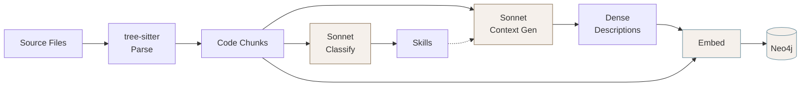
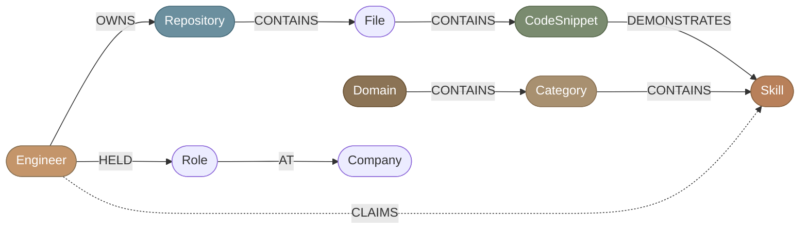
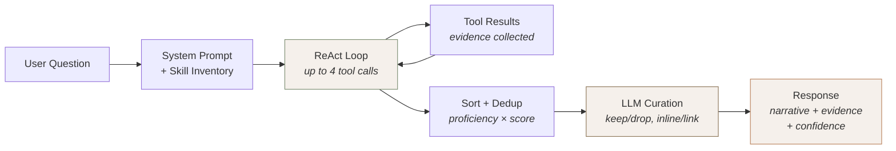

# 🔍 How It Works

> *"The purpose of a system is what it does."* — Stafford Beer

[← Back to README](../README.md) · See also [Architecture](ARCHITECTURE.md) · [Ingestion Guide](INGESTION.md)

This is the detailed walkthrough of each stage. For the high-level diagram, see
the [README](../README.md#-architecture-at-a-glance).

---

## 📥 Ingestion Pipeline

The ingestion pipeline transforms raw code and a resume into a searchable knowledge graph. It runs once (and is safe to re-run — it skips already-processed files). Think of it as building the brain 🧠

**1. 🌳 Parse** — Tree-sitter extracts every function and class from your source files. Supports Python, JavaScript, TypeScript, and TSX natively. Other languages get a fallback double-newline split so nothing is left behind.

**2. 🏷️ Classify** — Claude Sonnet reads each code snippet and maps it to skills from a curated taxonomy of ~85 skills across 11 domains (`src/ingestion/skill_taxonomy.py`). Snippets are batched (20 per LLM call) and processed concurrently. The classifier is constrained to the known skills list — no hallucinated skill names.

**3. 🪄 Generate Context** — This is where the magic happens. Raw code like `def refresh_token(client, token):` never mentions "OAuth" or "security" — but a recruiter will search for exactly those terms. Sonnet writes a dense paragraph per snippet that bridges this vocabulary gap. Each description captures four things:

- **What it does** — the business/system purpose
- **Engineering patterns** — design patterns and techniques used
- **Skill keywords** — restated in standard industry vocabulary matching the taxonomy
- **Quality signals** — production traits like error handling, concurrency safety, type safety

These descriptions are stored permanently on each `CodeSnippet` node and improve every future query's vector search. See `src/ingestion/context_generator.py` for the full system prompt.

**4. 🧲 Embed** — The final embedding input is `(context paragraph + metadata preamble + raw code)`, producing a 1024-dimensional vector. Vectors are stored per provider (`embedding_voyage` and `embedding_nim`) as separate Neo4j properties with separate vector indices.

**5. 🔗 Link** — Cypher creates the graph edges. Git blame extracts the earliest and latest commit dates for each snippet, stored as `first_seen` / `last_seen` on the `:DEMONSTRATES` relationship.

---

## 🕸️ Knowledge Graph

The Neo4j knowledge graph connects engineers to their code through a typed skill taxonomy. It's the backbone of everything 💪

**Key node types:**

| Node | Key Properties | Notes |
|------|---------------|-------|
| `CodeSnippet` | `content`, `context`, `embedding_voyage`, `embedding_nim`, `start_line`, `end_line`, `language` | The atomic unit of evidence 🔬 |
| `Skill` | `name`, `proficiency`, `snippet_count`, `repo_count` | Proficiency computed from evidence density |
| `Repository` | `name`, `default_branch`, `private`, `architecture` | `architecture` holds Opus-generated markdown with mermaid diagram |

**Proficiency levels** are computed from evidence density — no self-reporting, pure math 📐

| Level | Threshold | Meaning |
|-------|-----------|---------|
| 🟢 **Extensive** | 10+ snippets across 2+ repos | Deep, cross-project expertise |
| 🟡 **Moderate** | 3+ snippets | Solid working knowledge |
| 🟠 **Minimal** | 1+ snippet | Has touched it |

**The taxonomy** organizes skills into a 3-tier hierarchy: **Domain** (e.g., "Backend Engineering") > **Category** (e.g., "Web Frameworks") > **Skill** (e.g., "FastAPI"). 11 domains, 40+ categories, ~85 skills. See [`src/ingestion/skill_taxonomy.py`](../src/ingestion/skill_taxonomy.py) for the full tree.

Resume-parsed skills create `:CLAIMS` edges — these are "unverified" until matched to code evidence via `:DEMONSTRATES`. The gap analysis tool uses this distinction to report which claims are backed by code and which aren't. Claims without code? We'll let you know 👀

---

## 💬 Query Pipeline

When someone asks *"Does this engineer know Kubernetes?"*, here's what goes down:

**1. 🧭 System prompt assembly** — The agent gets a dynamically built prompt containing a skill inventory sorted strongest-first with proficiency levels and evidence counts. This lets the model make intelligent tool selection without needing to search first.

**2. 🔄 ReAct loop** — The agent makes up to 4 tool calls, choosing from 6 tools:

| Tool | What It Does | Best For |
|------|-------------|----------|
| 🔍 `search_code` | Vector similarity across all snippets | Broad or specific skill questions |
| 📊 `get_evidence` | Direct skill node lookup with proficiency | Skill deep-dives |
| 📄 `search_resume` | Full-text search over resume data | Career and role questions |
| 🕳️ `find_gaps` | Hierarchy-aware gap analysis | "What's missing for this role?" |
| 🏗️ `get_repo_overview` | Repo structure, top skills, **pre-seeded architecture summary** | Architecture questions |
| 🔗 `get_connected_evidence` | Multi-file snippets within one repo | System design questions |

**3. 📈 Evidence sorting** — Results are ranked by proficiency weight + similarity score, deduplicated by file path (keeping the best snippet per file), and interleaved by repository for diversity.

**4. ✂️ LLM curation** — The model reviews the top evidence and makes per-snippet decisions: keep or drop, display inline (show the code) or as a link (show an architectural explanation instead). Trivial code (one-line configs, bare imports) gets dropped. Each kept snippet gets a 1-2 sentence explanation of *why it's impressive*.

**5. 🎤 Response** — Two answer modes:
- **Skill questions:** 2-3 sentence narrative + curated evidence blocks with GitHub links, explanations, and confidence score.
- **Architecture questions** (*"How did Le build SPICE?"*): Detailed explanation with a pre-seeded mermaid diagram (generated by Opus at ingestion time, stored on the `Repository` node), rendered as an interactive SVG in the chat. Haiku includes the diagram verbatim rather than generating one on the fly — this ensures consistent, high-quality architectural visualizations.

🔒 Private repository code is automatically redacted from responses when `SHOW_PRIVATE_CODE=false` — context descriptions and GitHub links are still shown, but raw code is not.

---

## 📋 JD Match

Upload a job description (PDF, DOCX, or paste text) and PROVE breaks it into individual technical requirements, embeds each one, runs vector search against the knowledge graph, and computes per-requirement confidence:

- 💪 **Strong** — 3+ high-scoring code examples with extensive/moderate proficiency
- 🤏 **Partial** — Some evidence, lower scores or fewer examples
- ❌ **None** — No matching code found

Each requirement expands to show the matching code evidence with GitHub links. An overall match percentage and LLM-generated summary tie it together. It's like having a technical screener that never sleeps 🦉
